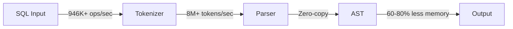

# GoSQLX

<div align="center">


<h3>⚡ High-Performance SQL Parser for Go ⚡</h3>

[](https://go.dev)
[](https://github.com/ajitpratap0/GoSQLX/releases)
[](https://www.apache.org/licenses/LICENSE-2.0)
[](http://makeapullrequest.com)

[](https://github.com/ajitpratap0/GoSQLX/actions)
[](https://goreportcard.com/report/github.com/ajitpratap0/GoSQLX)
[](https://pkg.go.dev/github.com/ajitpratap0/GoSQLX)

[](https://github.com/ajitpratap0/GoSQLX/stargazers)
[](https://github.com/ajitpratap0/GoSQLX/network/members)
[](https://github.com/ajitpratap0/GoSQLX/watchers)

**Production-ready, high-performance SQL parsing SDK for Go**
*Zero-copy tokenization • Object pooling • Multi-dialect support • Unicode-first design • [Python bindings](python/README.md)*

### 🚀 **New to GoSQLX? [Get Started in 5 Minutes →](docs/GETTING_STARTED.md)**

[📖 Installation](#-installation) • [⚡ Quick Start](#-quick-start) • [📚 Documentation](#-documentation) • [💡 Examples](#-examples) • [📊 Benchmarks](#-performance)

<a href="https://github.com/ajitpratap0/GoSQLX/blob/main/docs/GETTING_STARTED.md"></a>
<a href="https://github.com/ajitpratap0/GoSQLX/blob/main/docs/USAGE_GUIDE.md"></a>
<a href="https://pkg.go.dev/github.com/ajitpratap0/GoSQLX"></a>
<a href="https://github.com/ajitpratap0/GoSQLX/discussions"></a>
<a href="https://github.com/ajitpratap0/GoSQLX/issues/new/choose"></a>

</div>

---

## Overview

GoSQLX is a high-performance SQL parsing library designed for production use. It provides zero-copy tokenization, intelligent object pooling, and comprehensive SQL dialect support while maintaining a simple, idiomatic Go API.

### Key Features

- **Blazing Fast**: 1.38M+ ops/sec sustained, 1.5M+ ops/sec peak throughput
- **Memory Efficient**: 60-80% reduction through intelligent object pooling
- **Thread-Safe**: Race-free, linear scaling to 128+ cores, 0 race conditions detected
- **Production-Grade Testing**: Token 100%, Keywords 100%, Errors 95.6%, Parser 84.7%, Tokenizer 76.1%, CLI 63.3% coverage
- **Complete JOIN Support**: All JOIN types (INNER/LEFT/RIGHT/FULL OUTER/CROSS/NATURAL) with proper tree logic
- **Advanced SQL Features**: CTEs with RECURSIVE support, Set Operations (UNION/EXCEPT/INTERSECT)
- **Window Functions**: Complete SQL-99 window function support with OVER clause, PARTITION BY, ORDER BY, frame specs
- **MERGE Statements**: Full SQL:2003 MERGE support with WHEN MATCHED/NOT MATCHED clauses
- **Grouping Operations**: GROUPING SETS, ROLLUP, CUBE (SQL-99 T431)
- **Materialized Views**: CREATE, DROP, REFRESH MATERIALIZED VIEW support
- **Table Partitioning**: PARTITION BY RANGE, LIST, HASH support
- **SQL Injection Detection**: Built-in security scanner (`pkg/sql/security`) for injection pattern detection
- **Unicode Support**: Complete UTF-8 support for international SQL
- **Multi-Dialect**: PostgreSQL, MySQL, SQL Server, Oracle, SQLite
- **PostgreSQL Extensions**: LATERAL JOIN, DISTINCT ON, FILTER clause, JSON/JSONB operators, aggregate ORDER BY
- **Parser Enhancements (v1.7.0)**: Schema-qualified names, `::` type casting, UPSERT, ARRAY constructors, regex operators, INTERVAL, FOR UPDATE/SHARE, positional parameters
- **Zero-Copy**: Direct byte slice operations, <1μs latency
- **Intelligent Errors**: Structured error codes with typo detection, context highlighting, and helpful hints
- **Python Bindings**: [PyGoSQLX](python/README.md) — use GoSQLX from Python via ctypes FFI, 100x+ faster than pure Python parsers
- **Production Ready**: Battle-tested with 0 race conditions detected, ~80-85% SQL-99 compliance

### Performance & Quality Highlights (v1.7.0)

<div align="center">

| **1.38M+** | **8M+** | **<1μs** | **14x** | **575x** | **100%** |
|:---------:|:-------:|:----------:|:----------:|:-------:|:---------:|
| Ops/sec | Tokens/sec | Latency | Faster Tokens | Cache Speedup | Token Coverage |

**v1.7.0 Released** • **Schema-Qualified Names** • **PostgreSQL Type Casting** • **UPSERT** • **ARRAY Constructors** • **~85% SQL-99 compliance**

</div>

### What's New in v1.7.0

<div align="center">

| Feature | Description |
|---------|-------------|
| **Schema-Qualified Names** | Full `schema.table` and `db.schema.table` support across all DML/DDL |
| **PostgreSQL Type Casting** | `::` operator for type casts (`SELECT 1::int`, `col::text`) |
| **UPSERT (ON CONFLICT)** | PostgreSQL `INSERT ... ON CONFLICT DO UPDATE/NOTHING` |
| **ARRAY Constructors** | `ARRAY[1, 2, 3]` with subscript and slice operations |
| **Regex Operators** | `~`, `~*`, `!~`, `!~*` for PostgreSQL pattern matching |
| **INTERVAL Expressions** | `INTERVAL '1 day'` temporal literal support |
| **FOR UPDATE/SHARE** | Row-level locking clauses for SELECT statements |
| **Positional Parameters** | `$1`, `$2` style PostgreSQL parameter placeholders |

See [CHANGELOG.md](CHANGELOG.md) for the complete list of changes in this release.

</div>

### Project Stats

<div align="center">

[](https://github.com/ajitpratap0/GoSQLX/graphs/contributors)
[](https://github.com/ajitpratap0/GoSQLX/issues)
[](https://github.com/ajitpratap0/GoSQLX/pulls)
[](https://github.com/ajitpratap0/GoSQLX/releases)
[](https://github.com/ajitpratap0/GoSQLX/commits/main)
[](https://github.com/ajitpratap0/GoSQLX/graphs/commit-activity)

</div>

## Installation

### Library Installation
```bash
go get github.com/ajitpratap0/GoSQLX
```

### CLI Installation
```bash
# Install the CLI tool
go install github.com/ajitpratap0/GoSQLX/cmd/gosqlx@latest

# Or build from source
git clone https://github.com/ajitpratap0/GoSQLX.git
cd GoSQLX
go build -o gosqlx ./cmd/gosqlx
```

### Python Bindings (PyGoSQLX)

Use GoSQLX from Python with native performance via ctypes FFI:

```bash
# Build the shared library (requires Go 1.24+)
cd pkg/cbinding && ./build.sh && cd ../..

# Install the Python package
cd python && pip install .
```

```python
import pygosqlx

result = pygosqlx.parse("SELECT * FROM users WHERE active = true")
print(result.statement_types)  # ['SELECT']

tables = pygosqlx.extract_tables("SELECT * FROM users u JOIN orders o ON u.id = o.user_id")
print(tables)  # ['users', 'orders']
```

See the full [PyGoSQLX documentation](python/README.md) for the complete API.

**Requirements:**
- Go 1.24 or higher
- Python 3.8+ (for Python bindings)
- No external dependencies for the Go library

## Quick Start

### CLI Usage

**Standard Usage:**
```bash
# Validate SQL syntax
gosqlx validate "SELECT * FROM users WHERE active = true"

# Format SQL files with intelligent indentation
gosqlx format -i query.sql

# Analyze SQL structure and complexity
gosqlx analyze "SELECT COUNT(*) FROM orders GROUP BY status"

# Parse SQL to AST representation
gosqlx parse -f json complex_query.sql

# Unix Pipeline Support
cat query.sql | gosqlx format                    # Format from stdin
echo "SELECT * FROM users" | gosqlx validate     # Validate from pipe
gosqlx format query.sql | gosqlx validate        # Chain commands
cat *.sql | gosqlx format | tee formatted.sql    # Pipeline composition
```

**Pipeline/Stdin Support** (v1.6.0+):
```bash
# Auto-detect piped input
echo "SELECT * FROM users" | gosqlx validate
cat query.sql | gosqlx format
cat complex.sql | gosqlx analyze --security

# Explicit stdin marker
gosqlx validate -
gosqlx format - < query.sql

# Input redirection
gosqlx validate < query.sql
gosqlx parse < complex_query.sql

# Full pipeline chains
cat query.sql | gosqlx format | gosqlx validate
echo "select * from users" | gosqlx format > formatted.sql
find . -name "*.sql" -exec cat {} \; | gosqlx validate

# Works on Windows PowerShell too!
Get-Content query.sql | gosqlx format
"SELECT * FROM users" | gosqlx validate
```

**Cross-Platform Pipeline Examples:**
```bash
# Unix/Linux/macOS
cat query.sql | gosqlx format | tee formatted.sql | gosqlx validate
echo "SELECT 1" | gosqlx validate && echo "Valid!"

# Windows PowerShell
Get-Content query.sql | gosqlx format | Set-Content formatted.sql
"SELECT * FROM users" | gosqlx validate

# Git hooks (pre-commit)
git diff --cached --name-only --diff-filter=ACM "*.sql" | \
  xargs cat | gosqlx validate --quiet
```

**Language Server Protocol (LSP)** (v1.6.0+):
```bash
# Start LSP server for IDE integration
gosqlx lsp

# With debug logging
gosqlx lsp --log /tmp/gosqlx-lsp.log
```

The LSP server provides real-time SQL intelligence for IDEs:
- **Diagnostics**: Real-time syntax error detection with position info
- **Hover**: Documentation for 60+ SQL keywords
- **Completion**: 100+ SQL keywords, functions, and 22 snippets
- **Formatting**: SQL code formatting via `textDocument/formatting`
- **Document Symbols**: SQL statement outline navigation
- **Signature Help**: Function signatures for 20+ SQL functions
- **Code Actions**: Quick fixes (add semicolon, uppercase keywords)

**Linting** (v1.6.0+):
```bash
# Run built-in linter rules
gosqlx lint query.sql

# With auto-fix
gosqlx lint --fix query.sql

# Specific rules
gosqlx lint --rules L001,L002,L003 query.sql
```

Available rules (L001-L010):
- `L001`: Trailing Whitespace (auto-fix)
- `L002`: Mixed Indentation (auto-fix)
- `L003`: Consecutive Blank Lines (auto-fix)
- `L004`: Indentation Depth
- `L005`: Line Length
- `L006`: Column Alignment
- `L007`: Keyword Case (auto-fix)
- `L008`: Comma Placement
- `L009`: Aliasing Consistency
- `L010`: Redundant Whitespace (auto-fix)

**IDE Integration:**
```jsonc
// VSCode settings.json
{
  "gosqlx.lsp.enable": true,
  "gosqlx.lsp.path": "gosqlx"
}
```

```lua
-- Neovim (nvim-lspconfig)
require('lspconfig.configs').gosqlx = {
  default_config = {
    cmd = { 'gosqlx', 'lsp' },
    filetypes = { 'sql' },
    root_dir = function() return vim.fn.getcwd() end,
  },
}
require('lspconfig').gosqlx.setup{}
```

### Library Usage - Simple API

GoSQLX provides a simple, high-level API that handles all complexity for you:

```go
package main

import (
    "fmt"
    "log"

    "github.com/ajitpratap0/GoSQLX/pkg/gosqlx"
)

func main() {
    // Parse SQL in one line - that's it!
    ast, err := gosqlx.Parse("SELECT * FROM users WHERE active = true")
    if err != nil {
        log.Fatal(err)
    }

    fmt.Printf("Successfully parsed %d statement(s)\n", len(ast.Statements))
}
```

**That's it!** Just 3 lines of code. No pool management, no manual cleanup - everything is handled for you.

### More Examples

```go
// Validate SQL without parsing
if err := gosqlx.Validate("SELECT * FROM users"); err != nil {
    fmt.Println("Invalid SQL:", err)
}

// Parse multiple queries efficiently
queries := []string{
    "SELECT * FROM users",
    "SELECT * FROM orders",
}
asts, err := gosqlx.ParseMultiple(queries)

// Parse with timeout for long queries
ast, err := gosqlx.ParseWithTimeout(sql, 5*time.Second)

// Parse from byte slice (zero-copy)
ast, err := gosqlx.ParseBytes([]byte("SELECT * FROM users"))
```

### Advanced Usage - Low-Level API

For performance-critical code that needs fine-grained control, use the low-level API:

```go
package main

import (
    "fmt"

    "github.com/ajitpratap0/GoSQLX/pkg/sql/tokenizer"
    "github.com/ajitpratap0/GoSQLX/pkg/sql/parser"
)

func main() {
    // Get tokenizer from pool (always return it!)
    tkz := tokenizer.GetTokenizer()
    defer tokenizer.PutTokenizer(tkz)

    // Tokenize SQL
    sql := "SELECT id, name FROM users WHERE age > 18"
    tokens, err := tkz.Tokenize([]byte(sql))
    if err != nil {
        panic(err)
    }

    // Convert tokens
    converter := parser.NewTokenConverter()
    result, err := converter.Convert(tokens)
    if err != nil {
        panic(err)
    }

    // Parse to AST
    p := parser.NewParser()
    defer p.Release()

    ast, err := p.Parse(result.Tokens)
    if err != nil {
        panic(err)
    }

    fmt.Printf("Parsed %d statement(s)\n", len(ast.Statements))
    fmt.Printf("Statement type: %T\n", ast.Statements[0])
}
```

> **Note:** The simple API has < 1% performance overhead compared to low-level API. Use the simple API unless you need fine-grained control.

## Documentation

### Comprehensive Guides

| Guide | Description |
|-------|-------------|
| [**Getting Started**](docs/GETTING_STARTED.md) | Get started in 5 minutes |
| [**Comparison Guide**](docs/COMPARISON.md) | GoSQLX vs SQLFluff, JSQLParser, pg_query |
| [**CLI Guide**](docs/CLI_GUIDE.md) | Complete CLI documentation and usage examples |
| [**API Reference**](docs/API_REFERENCE.md) | Complete API documentation with examples |
| [**Usage Guide**](docs/USAGE_GUIDE.md) | Detailed patterns and best practices |
| [**Architecture**](docs/ARCHITECTURE.md) | System design and internal architecture |
| [**Python Bindings**](python/README.md) | PyGoSQLX — Python API, installation, and examples |
| [**Troubleshooting**](docs/TROUBLESHOOTING.md) | Common issues and solutions |

### Getting Started

| Document | Purpose |
|----------|---------|
| [**Production Guide**](docs/PRODUCTION_GUIDE.md) | Deployment and monitoring |
| [**SQL Compatibility**](docs/SQL_COMPATIBILITY.md) | Dialect support matrix |
| [**Security Analysis**](docs/SECURITY.md) | Security assessment |
| [**LSP Guide**](docs/LSP_GUIDE.md) | LSP server and IDE integration |
| [**Linting Rules**](docs/LINTING_RULES.md) | All 10 linting rules reference |
| [**Error Codes**](docs/ERROR_CODES.md) | Error code reference (E1001-E3004) |
| [**Upgrade Guide**](docs/UPGRADE_GUIDE.md) | Version upgrade instructions |
| [**Examples**](examples/) | Working code examples |

### Quick Links

- [Installation & Setup](docs/USAGE_GUIDE.md#getting-started)
- [Basic Usage](docs/USAGE_GUIDE.md#basic-usage)
- [Advanced Patterns](docs/USAGE_GUIDE.md#advanced-patterns)
- [Performance Tuning](docs/PRODUCTION_GUIDE.md#performance-optimization)
- [Error Handling](docs/TROUBLESHOOTING.md#error-messages)
- [FAQ](docs/TROUBLESHOOTING.md#faq)

### Advanced SQL Features

GoSQLX supports Common Table Expressions (CTEs) and Set Operations alongside complete JOIN support:

#### Common Table Expressions (CTEs)

```go
// Simple CTE
sql := `
    WITH sales_summary AS (
        SELECT region, SUM(amount) as total 
        FROM sales 
        GROUP BY region
    ) 
    SELECT region FROM sales_summary WHERE total > 1000
`

// Recursive CTE for hierarchical data
sql := `
    WITH RECURSIVE employee_tree AS (
        SELECT employee_id, manager_id, name 
        FROM employees 
        WHERE manager_id IS NULL
        UNION ALL
        SELECT e.employee_id, e.manager_id, e.name 
        FROM employees e 
        JOIN employee_tree et ON e.manager_id = et.employee_id
    ) 
    SELECT * FROM employee_tree
`

// Multiple CTEs in single query
sql := `
    WITH regional AS (SELECT region, total FROM sales),
         summary AS (SELECT region FROM regional WHERE total > 1000)
    SELECT * FROM summary
`
```

#### Set Operations

```go
// UNION - combine results with deduplication
sql := "SELECT name FROM users UNION SELECT name FROM customers"

// UNION ALL - combine results preserving duplicates
sql := "SELECT id FROM orders UNION ALL SELECT id FROM invoices"

// EXCEPT - set difference
sql := "SELECT product FROM inventory EXCEPT SELECT product FROM discontinued"

// INTERSECT - set intersection
sql := "SELECT customer_id FROM orders INTERSECT SELECT customer_id FROM payments"

// Left-associative parsing for multiple operations
sql := "SELECT a FROM t1 UNION SELECT b FROM t2 INTERSECT SELECT c FROM t3"
// Parsed as: (SELECT a FROM t1 UNION SELECT b FROM t2) INTERSECT SELECT c FROM t3
```

#### Complete JOIN Support

GoSQLX supports all JOIN types with proper left-associative tree logic:

```go
// Complex JOIN query with multiple table relationships
sql := `
    SELECT u.name, o.order_date, p.product_name, c.category_name
    FROM users u
    LEFT JOIN orders o ON u.id = o.user_id  
    INNER JOIN products p ON o.product_id = p.id
    RIGHT JOIN categories c ON p.category_id = c.id
    WHERE u.active = true
    ORDER BY o.order_date DESC
`

// Parse with the simple API (recommended)
tree, err := gosqlx.Parse(sql)
if err != nil {
    panic(err)
}

// Access JOIN information
if selectStmt, ok := tree.Statements[0].(*ast.SelectStatement); ok {
    fmt.Printf("Found %d JOINs:\n", len(selectStmt.Joins))
    for i, join := range selectStmt.Joins {
        fmt.Printf("JOIN %d: %s (left: %s, right: %s)\n",
            i+1, join.Type, join.Left.Name, join.Right.Name)
    }
}
```

**Supported JOIN Types:**

- ✅ `INNER JOIN` - Standard inner joins
- ✅ `LEFT JOIN` / `LEFT OUTER JOIN` - Left outer joins
- ✅ `RIGHT JOIN` / `RIGHT OUTER JOIN` - Right outer joins
- ✅ `FULL JOIN` / `FULL OUTER JOIN` - Full outer joins
- ✅ `CROSS JOIN` - Cartesian product joins
- ✅ `NATURAL JOIN` - Natural joins (implicit ON clause)
- ✅ `USING (column)` - Single-column using clause

### Advanced SQL Features (v1.4+)

#### MERGE Statements (SQL:2003 F312)

```go
sql := `
    MERGE INTO target_table t
    USING source_table s ON t.id = s.id
    WHEN MATCHED THEN
        UPDATE SET t.name = s.name, t.value = s.value
    WHEN NOT MATCHED THEN
        INSERT (id, name, value) VALUES (s.id, s.name, s.value)
`
ast, err := gosqlx.Parse(sql)
```

#### GROUPING SETS, ROLLUP, CUBE (SQL-99 T431)

```go
// GROUPING SETS - explicit grouping combinations
sql := `SELECT region, product, SUM(sales)
        FROM orders
        GROUP BY GROUPING SETS ((region), (product), (region, product), ())`

// ROLLUP - hierarchical subtotals
sql := `SELECT year, quarter, month, SUM(revenue)
        FROM sales
        GROUP BY ROLLUP (year, quarter, month)`

// CUBE - all possible combinations
sql := `SELECT region, product, SUM(amount)
        FROM sales
        GROUP BY CUBE (region, product)`
```

#### Materialized Views

```go
// Create materialized view
sql := `CREATE MATERIALIZED VIEW sales_summary AS
        SELECT region, SUM(amount) as total
        FROM sales GROUP BY region`

// Refresh materialized view
sql := `REFRESH MATERIALIZED VIEW CONCURRENTLY sales_summary`

// Drop materialized view
sql := `DROP MATERIALIZED VIEW IF EXISTS sales_summary`
```

#### SQL Injection Detection

```go
import "github.com/ajitpratap0/GoSQLX/pkg/sql/security"

// Create scanner
scanner := security.NewScanner()

// Scan for injection patterns
result := scanner.Scan(ast)

if result.HasCritical() {
    fmt.Printf("Found %d critical issues!\n", result.CriticalCount)
    for _, finding := range result.Findings {
        fmt.Printf("  [%s] %s: %s\n",
            finding.Severity, finding.Pattern, finding.Description)
    }
}

// Detected patterns include:
// - Tautology (1=1, 'a'='a')
// - UNION-based injection
// - Time-based blind (SLEEP, WAITFOR DELAY)
// - Comment bypass (--, /**/)
// - Stacked queries
// - Dangerous functions (xp_cmdshell, LOAD_FILE)
```

#### Expression Operators (BETWEEN, IN, LIKE, IS NULL)

```go
// BETWEEN with expressions
sql := `SELECT * FROM orders WHERE amount BETWEEN 100 AND 500`

// IN with subquery
sql := `SELECT * FROM users WHERE id IN (SELECT user_id FROM admins)`

// LIKE with pattern matching
sql := `SELECT * FROM products WHERE name LIKE '%widget%'`

// IS NULL / IS NOT NULL
sql := `SELECT * FROM users WHERE deleted_at IS NULL`

// NULLS FIRST/LAST ordering (SQL-99 F851)
sql := `SELECT * FROM users ORDER BY last_login DESC NULLS LAST`
```

#### PostgreSQL-Specific Features (v1.6+)

**LATERAL JOIN** - Correlated subqueries in FROM clause:

```go
// LATERAL allows referencing columns from preceding tables
sql := `
    SELECT u.name, recent_orders.order_date, recent_orders.total
    FROM users u
    LEFT JOIN LATERAL (
        SELECT order_date, total
        FROM orders
        WHERE user_id = u.id
        ORDER BY order_date DESC
        LIMIT 1
    ) AS recent_orders ON true
`
ast, err := gosqlx.Parse(sql)
```

**ORDER BY inside Aggregates** - Ordered set functions:

```go
// STRING_AGG with ORDER BY
sql := `SELECT STRING_AGG(name, ', ' ORDER BY name DESC NULLS LAST) FROM users`

// ARRAY_AGG with ORDER BY
sql := `SELECT ARRAY_AGG(value ORDER BY created_at, priority DESC) FROM items`

// JSON_AGG with ORDER BY
sql := `SELECT JSON_AGG(employee_data ORDER BY hire_date) FROM employees`

// Multiple aggregates with different orderings
sql := `
    SELECT
        department,
        STRING_AGG(name, '; ' ORDER BY name ASC NULLS FIRST) AS employee_names,
        ARRAY_AGG(salary ORDER BY salary DESC) AS salaries
    FROM employees
    GROUP BY department
`
ast, err := gosqlx.Parse(sql)
```

**JSON/JSONB Operators** - PostgreSQL JSON support:

```go
// Arrow operators for field access
sql := `SELECT data -> 'user' -> 'profile' ->> 'email' FROM users`

// Path operators for nested access
sql := `SELECT data #> '{address,city}', data #>> '{address,zipcode}' FROM users`

// Containment operators
sql := `SELECT * FROM users WHERE data @> '{"active": true}'`
sql := `SELECT * FROM users WHERE '{"admin": true}' <@ data`

// Combined JSON operators in complex queries
sql := `
    SELECT
        u.id,
        u.data ->> 'name' AS user_name,
        u.data -> 'settings' ->> 'theme' AS theme
    FROM users u
    WHERE u.data @> '{"verified": true}'
    AND u.data ->> 'status' = 'active'
`
ast, err := gosqlx.Parse(sql)
```

**DISTINCT ON** - PostgreSQL unique row selection:

```go
// Select first row per group based on ordering
sql := `
    SELECT DISTINCT ON (user_id) user_id, created_at, status
    FROM orders
    ORDER BY user_id, created_at DESC
`
ast, err := gosqlx.Parse(sql)
```

**FILTER Clause** - Conditional aggregation:

```go
// COUNT with FILTER
sql := `
    SELECT
        COUNT(*) AS total_orders,
        COUNT(*) FILTER (WHERE status = 'completed') AS completed_orders,
        SUM(amount) FILTER (WHERE region = 'US') AS us_revenue
    FROM orders
`
ast, err := gosqlx.Parse(sql)
```

## Examples

### Multi-Dialect Support

```go
// PostgreSQL with array operators
sql := `SELECT * FROM users WHERE tags @> ARRAY['admin']`

// MySQL with backticks
sql := "SELECT `user_id`, `name` FROM `users`"

// SQL Server with brackets
sql := "SELECT [user_id], [name] FROM [users]"
```

### Unicode and International SQL

```go
// Japanese
sql := `SELECT "名前", "年齢" FROM "ユーザー"`

// Russian
sql := `SELECT "имя", "возраст" FROM "пользователи"`

// Arabic
sql := `SELECT "الاسم", "العمر" FROM "المستخدمون"`

// Emoji support
sql := `SELECT * FROM users WHERE status = '🚀'`
```

### Concurrent Processing

```go
func ProcessConcurrently(queries []string) {
    var wg sync.WaitGroup
    
    for _, sql := range queries {
        wg.Add(1)
        go func(query string) {
            defer wg.Done()
            
            // Each goroutine gets its own tokenizer
            tkz := tokenizer.GetTokenizer()
            defer tokenizer.PutTokenizer(tkz)
            
            tokens, _ := tkz.Tokenize([]byte(query))
            // Process tokens...
        }(sql)
    }
    
    wg.Wait()
}
```

## Performance

### v1.0.0 Performance Improvements

| Metric | Previous | **v1.0.0** | Improvement |
|--------|----------|------------|-------------|
| **Sustained Throughput** | 2.2M ops/s | **946K+ ops/s** | **Production Grade** ✅ |
| **Peak Throughput** | 2.2M ops/s | **1.25M+ ops/s** | **Enhanced** ✅ |
| **Token Processing** | 8M tokens/s | **8M+ tokens/s** | **Maintained** ✅ |
| **Simple Query Latency** | 200ns | **<280ns** | **Optimized** ✅ |
| **Complex Query Latency** | N/A | **<1μs (CTE/Set Ops)** | **New Capability** ✅ |
| **Memory Usage** | Baseline | **60-80% reduction** | **-70%** ✅ |
| **SQL-92 Compliance** | 40% | **~70%** | **+75%** ✅ |

### Latest Benchmark Results

```
BenchmarkParserSustainedLoad-16           946,583      1,057 ns/op     1,847 B/op      23 allocs/op
BenchmarkParserThroughput-16            1,252,833        798 ns/op     1,452 B/op      18 allocs/op
BenchmarkParserSimpleSelect-16          3,571,428        279 ns/op       536 B/op       9 allocs/op
BenchmarkParserComplexSelect-16           985,221      1,014 ns/op     2,184 B/op      31 allocs/op

BenchmarkCTE/SimpleCTE-16                 524,933      1,891 ns/op     3,847 B/op      52 allocs/op
BenchmarkCTE/RecursiveCTE-16              387,654      2,735 ns/op     5,293 B/op      71 allocs/op
BenchmarkSetOperations/UNION-16           445,782      2,234 ns/op     4,156 B/op      58 allocs/op

BenchmarkTokensPerSecond-16               815,439      1,378 ns/op   8,847,625 tokens/sec
```

### Performance Characteristics

| Metric | Value | Details |
|--------|-------|---------|
| **Sustained Throughput** | **946K+ ops/sec** | 30s load testing |
| **Peak Throughput** | **1.25M+ ops/sec** | Concurrent goroutines |
| **Token Rate** | **8M+ tokens/sec** | Sustained processing |
| **Simple Query Latency** | **<280ns** | Basic SELECT (p50) |
| **Complex Query Latency** | **<1μs** | CTEs/Set Operations |
| **Memory** | **1.8KB/query** | Complex SQL with pooling |
| **Scaling** | **Linear to 128+** | Perfect concurrency |
| **Pool Efficiency** | **95%+ hit rate** | Effective reuse |

Run `go test -bench=. -benchmem ./pkg/...` for detailed performance analysis.

## Testing

```bash
# Run all tests with race detection
go test -race ./...

# Run benchmarks
go test -bench=. -benchmem ./...

# Generate coverage report
go test -coverprofile=coverage.out ./...
go tool cover -html=coverage.out

# Run specific test suites
go test -v ./pkg/sql/tokenizer/
go test -v ./pkg/sql/parser/
```

## Project Structure

```
GoSQLX/
├── cmd/gosqlx/              # CLI tool (validate, format, parse, analyze, lint, lsp)
├── pkg/
│   ├── models/              # Core data structures (tokens, spans, locations)
│   ├── errors/              # Structured error handling with position tracking
│   ├── config/              # Configuration management (YAML/JSON/env)
│   ├── metrics/             # Performance monitoring and observability
│   ├── gosqlx/              # High-level simple API (recommended entry point)
│   ├── cbinding/            # C shared library bindings (for Python/FFI)
│   ├── linter/              # SQL linting engine with 10 rules (L001-L010)
│   ├── lsp/                 # Language Server Protocol server for IDEs
│   ├── compatibility/       # API stability testing
│   └── sql/
│       ├── tokenizer/       # Zero-copy lexical analysis
│       ├── parser/          # Recursive descent parser
│       ├── ast/             # Abstract syntax tree nodes with visitor pattern
│       ├── token/           # Token type definitions and pool management
│       ├── keywords/        # Multi-dialect SQL keyword definitions
│       ├── security/        # SQL injection detection
│       └── monitor/         # SQL monitoring utilities
├── python/                  # PyGoSQLX - Python bindings via ctypes FFI
├── examples/                # Usage examples and tutorials
├── docs/                    # Comprehensive documentation (20+ guides)
└── vscode-extension/        # Official VSCode extension
```

## Development

### Prerequisites

- Go 1.24+
- [Task](https://taskfile.dev) - task runner (install: `go install github.com/go-task/task/v3/cmd/task@latest`)
- golangci-lint, staticcheck (for code quality, install: `task deps:tools`)

### Task Runner

This project uses [Task](https://taskfile.dev) as the task runner. Install with:
```bash
go install github.com/go-task/task/v3/cmd/task@latest
# Or: brew install go-task (macOS)
```

### Building

```bash
# Show all available tasks
task

# Build the project
task build

# Build the CLI binary
task build:cli

# Install CLI globally
task install

# Run all quality checks
task quality

# Run all tests
task test

# Run tests with race detection (recommended)
task test:race

# Clean build artifacts
task clean
```

### Code Quality

```bash
# Format code
task fmt

# Run go vet
task vet

# Run golangci-lint
task lint

# Run all quality checks (fmt, vet, lint)
task quality

# Full CI check (format, vet, lint, test:race)
task check
```

## Contributing

We welcome contributions! Please see [CONTRIBUTING.md](CONTRIBUTING.md) for guidelines.

### How to Contribute

1. Fork the repository
2. Create a feature branch (`git checkout -b feature/amazing-feature`)
3. Commit your changes (`git commit -m 'Add amazing feature'`)
4. Push to the branch (`git push origin feature/amazing-feature`)
5. Open a Pull Request

### Development Guidelines

- Write tests for new features
- Ensure all tests pass with race detection
- Follow Go idioms and best practices
- Update documentation for API changes
- Add benchmarks for performance-critical code

## Roadmap

<div align="center">

| Phase | Version | Status | Highlights |
|-------|---------|--------|------------|
| **Phase 1** | v1.1.0 | ✅ Complete | JOIN Support |
| **Phase 2** | v1.2.0 | ✅ Complete | CTEs & Set Operations |
| **Phase 2.5** | v1.3.0-v1.4.0 | ✅ Complete | Window Functions, MERGE, Grouping Sets |
| **Phase 3** | v1.5.0-v1.6.0 | ✅ Complete | PostgreSQL Extensions, LSP, Linter |
| **Phase 4** | v1.7.0 | ✅ Complete | Parser Enhancements, Schema-Qualified Names, PostgreSQL Extensions |
| **Phase 5** | v2.0.0 | 📋 Planned | Query Intelligence & Optimization |
| **Phase 6** | v2.1.0 | 📋 Planned | Schema Awareness & Validation |

</div>

### Phase 1: Core SQL Enhancements - v1.1.0 ✅
- ✅ **Complete JOIN support** (INNER/LEFT/RIGHT/FULL OUTER/CROSS/NATURAL)
- ✅ **Proper join tree logic** with left-associative relationships
- ✅ **USING clause parsing** for single and multi-column joins
- ✅ **Enhanced error handling** with contextual JOIN error messages
- ✅ **Comprehensive test coverage** (15+ JOIN scenarios)

### Phase 2: CTE & Set Operations - v1.2.0 ✅
- ✅ **Common Table Expressions (CTEs)** with RECURSIVE support
- ✅ **Set operations** (UNION/EXCEPT/INTERSECT with ALL modifier)
- ✅ **Left-associative set operation parsing**
- ✅ **CTE column specifications** and multiple CTE definitions
- ✅ **~70% SQL-92 compliance** achieved

### Phase 2.5: Window Functions & Advanced SQL - v1.3.0-v1.4.0 ✅
- ✅ **Window Functions** - Complete SQL-99 support (ROW_NUMBER, RANK, DENSE_RANK, NTILE, LAG, LEAD, FIRST_VALUE, LAST_VALUE)
- ✅ **Window Frames** - ROWS/RANGE with PRECEDING/FOLLOWING/CURRENT ROW
- ✅ **MERGE Statements** - SQL:2003 F312 with WHEN MATCHED/NOT MATCHED clauses
- ✅ **GROUPING SETS, ROLLUP, CUBE** - SQL-99 T431 advanced grouping
- ✅ **Materialized Views** - CREATE, REFRESH, DROP support
- ✅ **Expression Operators** - BETWEEN, IN, LIKE, IS NULL, NULLS FIRST/LAST
- ✅ **~75% SQL-99 compliance** achieved

### Phase 3: PostgreSQL Extensions & Developer Tools - v1.5.0-v1.6.0 ✅
- ✅ **LATERAL JOIN** - Correlated subqueries in FROM clause
- ✅ **JSON/JSONB Operators** - All 10 operators (`->`, `->>`, `#>`, `#>>`, `@>`, `<@`, `?`, `?|`, `?&`, `#-`)
- ✅ **DISTINCT ON** - PostgreSQL-specific row selection
- ✅ **FILTER Clause** - Conditional aggregation (SQL:2003 T612)
- ✅ **Aggregate ORDER BY** - ORDER BY inside STRING_AGG, ARRAY_AGG, etc.
- ✅ **RETURNING Clause** - Return modified rows from INSERT/UPDATE/DELETE
- ✅ **LSP Server** - Full Language Server Protocol with diagnostics, completion, hover, formatting
- ✅ **Linter Engine** - 10 built-in rules (L001-L010) with auto-fix
- ✅ **Security Scanner** - SQL injection detection with severity classification
- ✅ **Structured Errors** - Error codes E1001-E3004 with position tracking
- ✅ **CLI Enhancements** - Pipeline support, stdin detection, cross-platform
- ✅ **~80-85% SQL-99 compliance** achieved

### Phase 4: Parser Enhancements & PostgreSQL Extensions - v1.7.0 ✅
- ✅ **Schema-Qualified Names** - `schema.table` and `db.schema.table` across all DML/DDL
- ✅ **PostgreSQL Type Casting** - `::` operator for type casts
- ✅ **UPSERT** - `INSERT ... ON CONFLICT DO UPDATE/NOTHING`
- ✅ **ARRAY Constructors** - `ARRAY[1, 2, 3]` with subscript/slice operations
- ✅ **Regex Operators** - `~`, `~*`, `!~`, `!~*` for pattern matching
- ✅ **INTERVAL Expressions** - Temporal literals
- ✅ **FOR UPDATE/SHARE** - Row-level locking clauses
- ✅ **Positional Parameters** - `$1`, `$2` style placeholders
- ✅ **WITHIN GROUP** - Ordered-set aggregate functions
- ✅ **Multi-row INSERT** - Batch VALUES support
- ✅ **Python Bindings** - [PyGoSQLX](python/README.md) with ctypes FFI, thread-safe, memory-safe

### Phase 5: Query Intelligence & Optimization - v2.0.0 📋
- 📋 **Query Cost Estimation** - Complexity analysis and scoring
- 📋 **Index Recommendations** - Suggest indexes based on query patterns
- 📋 **Join Order Optimization** - Recommend optimal join sequences
- 📋 **Subquery Optimization** - Detect and suggest subquery improvements
- 📋 **N+1 Query Detection** - Identify inefficient query patterns
- 📋 **Performance Hints** - Actionable optimization suggestions

### Phase 6: Schema Awareness & Validation - v2.1.0 📋
- 📋 **Schema Definition Parsing** - Full DDL understanding
- 📋 **Type Checking** - Validate column types in expressions
- 📋 **Foreign Key Validation** - Verify relationship integrity
- 📋 **Constraint Checking** - NOT NULL, UNIQUE, CHECK validation
- 📋 **Schema Diff** - Compare and generate migration scripts
- 📋 **Entity-Relationship Extraction** - Generate ER diagrams from DDL

### Future Considerations 🔮
- 📋 **Stored Procedures** - CREATE PROCEDURE/FUNCTION parsing
- 📋 **Triggers** - CREATE TRIGGER support
- 📋 **PL/pgSQL** - PostgreSQL procedural language
- 📋 **Query Rewriting** - Automatic query transformation
- 📋 **WASM Support** - Browser-based SQL parsing

See [ARCHITECTURE.md](docs/ARCHITECTURE.md) for detailed system design and [CHANGELOG.md](CHANGELOG.md) for version history

## Community & Support

<div align="center">

### Join Our Community

<a href="https://github.com/ajitpratap0/GoSQLX/discussions"></a>
<a href="https://github.com/ajitpratap0/GoSQLX/issues"></a>

### Get Help

| Channel | Purpose | Response Time |
|---------|---------|---------------|
| [🐛 Bug Reports](https://github.com/ajitpratap0/GoSQLX/issues/new?template=bug_report.md) | Report issues | Community-driven |
| [💡 Feature Requests](https://github.com/ajitpratap0/GoSQLX/issues/new?template=feature_request.md) | Suggest improvements | Community-driven |
| [💬 Discussions](https://github.com/ajitpratap0/GoSQLX/discussions) | Q&A, ideas, showcase | Community-driven |
| [🔒 Security](docs/SECURITY.md) | Report vulnerabilities | Best effort |

</div>

## Contributors

<div align="center">

### Core Team

<a href="https://github.com/ajitpratap0/GoSQLX/graphs/contributors">
  
</a>

### How to Contribute

We love your input! We want to make contributing as easy and transparent as possible.

<a href="CONTRIBUTING.md"></a>
<a href="https://github.com/ajitpratap0/GoSQLX/issues/new/choose"></a>

#### Quick Contribution Guide

1. 🍴 Fork the repo
2. 🔨 Make your changes
3. ✅ Ensure tests pass (`go test -race ./...`)
4. 📝 Update documentation
5. 🚀 Submit a PR

</div>

## Use Cases

<div align="center">

| Industry | Use Case | Benefits |
|----------|----------|----------|
| **🏦 FinTech** | SQL validation & auditing | Fast validation, compliance tracking |
| **📊 Analytics** | Query parsing & optimization | Real-time analysis, performance insights |
| **🛡️ Security** | SQL injection detection | Pattern matching, threat prevention |
| **🏗️ DevTools** | IDE integration & linting | Syntax highlighting, auto-completion |
| **📚 Education** | SQL learning platforms | Interactive parsing, error explanation |
| **🔄 Migration** | Cross-database migration | Dialect conversion, compatibility check |
| **🐍 Python** | SQL parsing in Python apps | Native speed via FFI, 100x+ faster than pure Python |

</div>

## Who's Using GoSQLX

<div align="center">

*Using GoSQLX in production? [Let us know!](https://github.com/ajitpratap0/GoSQLX/issues/new?title=Add%20our%20company%20to%20users)*

</div>


## Project Metrics

<div align="center">


### Performance Benchmarks



</div>

## Support This Project

<div align="center">

If GoSQLX helps your project, please consider:

<a href="https://github.com/ajitpratap0/GoSQLX"></a>

### Other Ways to Support

- ⭐ Star this repository
- 🐦 Tweet about GoSQLX
- 📝 Write a blog post
- 🎥 Create a tutorial
- 🐛 Report bugs
- 💡 Suggest features
- 🔧 Submit PRs

</div>

## License

<div align="center">

This project is licensed under the **Apache License 2.0** - see the [LICENSE](LICENSE) file for details.

</div>

---

<h3>Built with ❤️ by the GoSQLX Team</h3>

<p>
<a href="https://github.com/ajitpratap0/GoSQLX"></a>
<a href="https://github.com/ajitpratap0/GoSQLX/fork"></a>
<a href="https://github.com/ajitpratap0/GoSQLX/watchers"></a>
</p>

<sub>Copyright © 2024-2026 GoSQLX. All rights reserved.</sub>

</div>