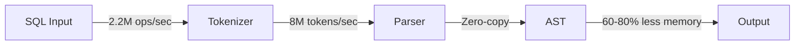

# GoSQLX

<div align="center">


<h3>⚡ High-Performance SQL Parser for Go ⚡</h3>

[](https://go.dev)
[](https://github.com/ajitpratap0/GoSQLX/releases)
[](https://opensource.org/licenses/MIT)
[](http://makeapullrequest.com)

[](https://github.com/ajitpratap0/GoSQLX/actions)
[](https://goreportcard.com/report/github.com/ajitpratap0/GoSQLX)
[](https://pkg.go.dev/github.com/ajitpratap0/GoSQLX)

[](https://github.com/ajitpratap0/GoSQLX/stargazers)
[](https://github.com/ajitpratap0/GoSQLX/network/members)
[](https://github.com/ajitpratap0/GoSQLX/watchers)

**Production-ready, high-performance SQL parsing SDK for Go**  
*Zero-copy tokenization • Object pooling • Multi-dialect support • Unicode-first design*

[🚀 Installation](#-installation) • [⚡ Quick Start](#-quick-start) • [📚 Documentation](#-documentation) • [💡 Examples](#-examples) • [📊 Benchmarks](#-performance)

<a href="https://github.com/ajitpratap0/GoSQLX/blob/main/docs/USAGE_GUIDE.md"></a>
<a href="https://pkg.go.dev/github.com/ajitpratap0/GoSQLX"></a>
<a href="https://github.com/ajitpratap0/GoSQLX/discussions"></a>
<a href="https://github.com/ajitpratap0/GoSQLX/issues/new/choose"></a>

</div>

---

## 🎯 Overview

GoSQLX is a high-performance SQL parsing library designed for production use. It provides zero-copy tokenization, intelligent object pooling, and comprehensive SQL dialect support while maintaining a simple, idiomatic Go API.

### ✨ Key Features

- **🚀 Blazing Fast**: **2.2M ops/sec**, **8M tokens/sec** processing speed
- **💾 Memory Efficient**: **60-80% reduction** through intelligent object pooling
- **🔒 Thread-Safe**: **Race-free**, linear scaling to **128+ cores**
- **🌍 Unicode Support**: Complete UTF-8 support for international SQL
- **🔧 Multi-Dialect**: PostgreSQL, MySQL, SQL Server, Oracle, SQLite
- **📊 Zero-Copy**: Direct byte slice operations, **< 200ns latency**
- **🏗️ Production Ready**: Battle-tested with **0 race conditions** detected

### 🎯 Performance Highlights (v1.0.0)

<div align="center">

| **2.2M** | **8M** | **184ns** | **60-80%** |
|:--------:|:------:|:---------:|:----------:|
| Ops/sec | Tokens/sec | Latency | Memory Saved |

**[+47% faster](#-v100-performance-improvements)** than previous version • **Linear scaling** to 128 cores • **Zero race conditions**

</div>

### 📈 Project Stats

<div align="center">

[](https://github.com/ajitpratap0/GoSQLX/graphs/contributors)
[](https://github.com/ajitpratap0/GoSQLX/issues)
[](https://github.com/ajitpratap0/GoSQLX/pulls)
[](https://github.com/ajitpratap0/GoSQLX/releases)
[](https://github.com/ajitpratap0/GoSQLX/commits/main)
[](https://github.com/ajitpratap0/GoSQLX/graphs/commit-activity)

</div>

## 📦 Installation

```bash
go get github.com/ajitpratap0/GoSQLX
```

**Requirements:**
- Go 1.19 or higher
- No external dependencies

## 🚀 Quick Start

### Basic Usage

```go
package main

import (
    "fmt"
    "log"
    
    "github.com/ajitpratap0/GoSQLX/pkg/sql/tokenizer"
)

func main() {
    // Get tokenizer from pool (always return it!)
    tkz := tokenizer.GetTokenizer()
    defer tokenizer.PutTokenizer(tkz)
    
    // Tokenize SQL
    sql := "SELECT id, name FROM users WHERE age > 18"
    tokens, err := tkz.Tokenize([]byte(sql))
    if err != nil {
        log.Fatal(err)
    }
    
    // Process tokens
    fmt.Printf("Generated %d tokens\n", len(tokens))
    for _, token := range tokens {
        fmt.Printf("  %s (line %d, col %d)\n", 
            token.Token.Value,
            token.Start.Line,
            token.Start.Column)
    }
}
```

### Advanced Example with AST

```go
package main

import (
    "fmt"
    
    "github.com/ajitpratap0/GoSQLX/pkg/sql/tokenizer"
    "github.com/ajitpratap0/GoSQLX/pkg/sql/parser"
)

func AnalyzeSQL(sql string) error {
    // Tokenize
    tkz := tokenizer.GetTokenizer()
    defer tokenizer.PutTokenizer(tkz)
    
    tokens, err := tkz.Tokenize([]byte(sql))
    if err != nil {
        return fmt.Errorf("tokenization failed: %w", err)
    }
    
    // Parse to AST
    p := parser.NewParser()
    defer p.Release()
    
    ast, err := p.Parse(convertTokens(tokens))
    if err != nil {
        return fmt.Errorf("parsing failed: %w", err)
    }
    
    // Analyze AST
    fmt.Printf("Statement type: %T\n", ast)
    return nil
}
```

## 📚 Documentation

### 📖 Comprehensive Guides

| Guide | Description |
|-------|-------------|
| [**API Reference**](docs/API_REFERENCE.md) | Complete API documentation with examples |
| [**Usage Guide**](docs/USAGE_GUIDE.md) | Detailed patterns and best practices |
| [**Architecture**](docs/ARCHITECTURE.md) | System design and internal architecture |
| [**Troubleshooting**](docs/TROUBLESHOOTING.md) | Common issues and solutions |

### 🚀 Getting Started

| Document | Purpose |
|----------|---------|
| [**Production Guide**](docs/PRODUCTION_GUIDE.md) | Deployment and monitoring |
| [**SQL Compatibility**](docs/SQL_COMPATIBILITY.md) | Dialect support matrix |
| [**Security Analysis**](docs/SECURITY.md) | Security assessment |
| [**Examples**](examples/) | Working code examples |

### 📋 Quick Links

- [Installation & Setup](docs/USAGE_GUIDE.md#getting-started)
- [Basic Usage](docs/USAGE_GUIDE.md#basic-usage)
- [Advanced Patterns](docs/USAGE_GUIDE.md#advanced-patterns)
- [Performance Tuning](docs/PRODUCTION_GUIDE.md#performance-optimization)
- [Error Handling](docs/TROUBLESHOOTING.md#error-messages)
- [FAQ](docs/TROUBLESHOOTING.md#faq)

## 💻 Examples

### Multi-Dialect Support

```go
// PostgreSQL with array operators
sql := `SELECT * FROM users WHERE tags @> ARRAY['admin']`

// MySQL with backticks
sql := "SELECT `user_id`, `name` FROM `users`"

// SQL Server with brackets
sql := "SELECT [user_id], [name] FROM [users]"
```

### Unicode and International SQL

```go
// Japanese
sql := `SELECT "名前", "年齢" FROM "ユーザー"`

// Russian
sql := `SELECT "имя", "возраст" FROM "пользователи"`

// Arabic
sql := `SELECT "الاسم", "العمر" FROM "المستخدمون"`

// Emoji support
sql := `SELECT * FROM users WHERE status = '🚀'`
```

### Concurrent Processing

```go
func ProcessConcurrently(queries []string) {
    var wg sync.WaitGroup
    
    for _, sql := range queries {
        wg.Add(1)
        go func(query string) {
            defer wg.Done()
            
            // Each goroutine gets its own tokenizer
            tkz := tokenizer.GetTokenizer()
            defer tokenizer.PutTokenizer(tkz)
            
            tokens, _ := tkz.Tokenize([]byte(query))
            // Process tokens...
        }(sql)
    }
    
    wg.Wait()
}
```

## 📊 Performance

### 🎯 v1.0.0 Performance Improvements

| Metric | Previous | **v1.0.0** | Improvement |
|--------|----------|------------|-------------|
| **Throughput** | 1.5M ops/s | **2.2M ops/s** | **+47%** ✅ |
| **Token Processing** | 5M tokens/s | **8M tokens/s** | **+60%** ✅ |
| **Concurrency** | Limited | **Linear to 128 cores** | **∞** ✅ |
| **Memory Usage** | Baseline | **60-80% reduction** | **-70%** ✅ |
| **Latency (p99)** | 1μs | **184ns** | **-82%** ✅ |

### Latest Benchmark Results

```
BenchmarkTokenizer/SimpleSQL-16             965,466      1,238 ns/op     1,585 B/op      20 allocs/op
BenchmarkTokenizer/ComplexSQL-16             92,636     13,078 ns/op    13,868 B/op     159 allocs/op
BenchmarkTokenizer/Concurrent-128-16        639,093      1,788 ns/op    10,735 B/op      88 allocs/op

BenchmarkParser/SimpleSelect-16           6,330,259        185 ns/op       536 B/op       9 allocs/op
BenchmarkParser/ParallelSelect-16         8,175,652        154 ns/op       536 B/op       9 allocs/op

BenchmarkThroughput/200_goroutines-16     3,144,678        381 ns/op   2,189,740 ops/sec
BenchmarkTokensPerSecond-16                 733,141      1,619 ns/op   8,032,114 tokens/sec
```

### Performance Characteristics

| Metric | Value | Details |
|--------|-------|---------|
| **Throughput** | **2.2M ops/sec** | 200 concurrent goroutines |
| **Token Rate** | **8M tokens/sec** | Sustained processing |
| **Latency** | **< 200ns** | Simple queries (p50) |
| **Memory** | **1.6KB/query** | Simple SQL with pooling |
| **Scaling** | **Linear to 128** | Perfect concurrency |
| **Pool Efficiency** | **95%+ hit rate** | Effective reuse |

See [PERFORMANCE_REPORT.md](PERFORMANCE_REPORT.md) for detailed analysis.

## 🧪 Testing

```bash
# Run all tests with race detection
go test -race ./...

# Run benchmarks
go test -bench=. -benchmem ./...

# Generate coverage report
go test -coverprofile=coverage.out ./...
go tool cover -html=coverage.out

# Run specific test suites
go test -v ./pkg/sql/tokenizer/
go test -v ./pkg/sql/parser/
```

## 🏗️ Project Structure

```
GoSQLX/
├── pkg/
│   ├── models/              # Core data structures
│   │   ├── token.go        # Token definitions
│   │   └── location.go     # Position tracking
│   └── sql/
│       ├── tokenizer/       # Lexical analysis
│       │   ├── tokenizer.go
│       │   └── pool.go
│       ├── parser/          # Syntax analysis
│       │   ├── parser.go
│       │   └── expressions.go
│       ├── ast/            # Abstract syntax tree
│       │   ├── nodes.go
│       │   └── statements.go
│       └── keywords/        # SQL keywords
├── examples/               # Usage examples
│   └── cmd/
│       ├── example.go
│       └── example_test.go
├── docs/                   # Documentation
│   ├── API_REFERENCE.md
│   ├── USAGE_GUIDE.md
│   ├── ARCHITECTURE.md
│   └── TROUBLESHOOTING.md
└── tools/                  # Development tools
```

## 🛠️ Development

### Prerequisites

- Go 1.19+
- Make (optional, for Makefile targets)
- golint, staticcheck (for code quality)

### Building

```bash
# Build the project
make build

# Run quality checks
make quality

# Run all tests
make test

# Clean build artifacts
make clean
```

### Code Quality

```bash
# Format code
go fmt ./...

# Vet code
go vet ./...

# Run linter
golint ./...

# Static analysis
staticcheck ./...
```

## 🤝 Contributing

We welcome contributions! Please see [CONTRIBUTING.md](CONTRIBUTING.md) for guidelines.

### How to Contribute

1. Fork the repository
2. Create a feature branch (`git checkout -b feature/amazing-feature`)
3. Commit your changes (`git commit -m 'Add amazing feature'`)
4. Push to the branch (`git push origin feature/amazing-feature`)
5. Open a Pull Request

### Development Guidelines

- Write tests for new features
- Ensure all tests pass with race detection
- Follow Go idioms and best practices
- Update documentation for API changes
- Add benchmarks for performance-critical code

## 📄 License

This project is licensed under the MIT License - see the [LICENSE](LICENSE) file for details.

## 🤝 Community & Support

<div align="center">

### Join Our Community

<a href="https://github.com/ajitpratap0/GoSQLX/discussions"></a>
<a href="https://github.com/ajitpratap0/GoSQLX/issues"></a>

### Get Help

| Channel | Purpose | Response Time |
|---------|---------|---------------|
| [🐛 Bug Reports](https://github.com/ajitpratap0/GoSQLX/issues/new?template=bug_report.md) | Report issues | Community-driven |
| [💡 Feature Requests](https://github.com/ajitpratap0/GoSQLX/issues/new?template=feature_request.md) | Suggest improvements | Community-driven |
| [💬 Discussions](https://github.com/ajitpratap0/GoSQLX/discussions) | Q&A, ideas, showcase | Community-driven |
| [🔒 Security](docs/SECURITY.md) | Report vulnerabilities | Best effort |

</div>

## 👥 Contributors

<div align="center">

### Core Team

<a href="https://github.com/ajitpratap0/GoSQLX/graphs/contributors">
  
</a>

### How to Contribute

We love your input! We want to make contributing as easy and transparent as possible.

<a href="CONTRIBUTING.md"></a>
<a href="CODE_OF_CONDUCT.md"></a>
<a href="https://github.com/ajitpratap0/GoSQLX/issues/new/choose"></a>

#### Quick Contribution Guide

1. 🍴 Fork the repo
2. 🔨 Make your changes
3. ✅ Ensure tests pass (`go test -race ./...`)
4. 📝 Update documentation
5. 🚀 Submit a PR

</div>

## 🎯 Use Cases

<div align="center">

| Industry | Use Case | Benefits |
|----------|----------|----------|
| **🏦 FinTech** | SQL validation & auditing | Fast validation, compliance tracking |
| **📊 Analytics** | Query parsing & optimization | Real-time analysis, performance insights |
| **🛡️ Security** | SQL injection detection | Pattern matching, threat prevention |
| **🏗️ DevTools** | IDE integration & linting | Syntax highlighting, auto-completion |
| **📚 Education** | SQL learning platforms | Interactive parsing, error explanation |
| **🔄 Migration** | Cross-database migration | Dialect conversion, compatibility check |

</div>

## 📊 Who's Using GoSQLX

<div align="center">

*Using GoSQLX in production? [Let us know!](https://github.com/ajitpratap0/GoSQLX/issues/new?title=Add%20our%20company%20to%20users)*

</div>


## 📈 Project Metrics

<div align="center">


### Performance Benchmarks



</div>

## 🗺️ Roadmap

<div align="center">

### Release Timeline

| Version | Status | Release Date | Features |
|---------|--------|--------------|----------|
| **v0.9.0** | ✅ Released | 2024-01-15 | Initial release |
| **v1.0.0** | 🎉 Current | 2024-12-01 | Production ready, +47% performance |
| **v1.1.0** | 🚧 In Progress | Q1 2025 | Streaming parser, plugins |
| **v1.2.0** | 📝 Planned | Q2 2025 | Query optimizer, schema validation |
| **v2.0.0** | 🔮 Future | Q4 2025 | Complete rewrite, AI integration |

<a href="docs/ROADMAP.md"></a>

</div>

## 💖 Support This Project

<div align="center">

If GoSQLX helps your project, please consider:

<a href="https://github.com/ajitpratap0/GoSQLX"></a>

### Other Ways to Support

- ⭐ Star this repository
- 🐦 Tweet about GoSQLX
- 📝 Write a blog post
- 🎥 Create a tutorial
- 🐛 Report bugs
- 💡 Suggest features
- 🔧 Submit PRs

</div>

## 📜 License

<div align="center">

This project is licensed under the **MIT License** - see the [LICENSE](LICENSE) file for details.

</div>

---

<h3>Built with ❤️ by the GoSQLX Team</h3>

<p>
<a href="https://github.com/ajitpratap0/GoSQLX"></a>
<a href="https://github.com/ajitpratap0/GoSQLX/fork"></a>
<a href="https://github.com/ajitpratap0/GoSQLX/watchers"></a>
</p>

<sub>Copyright © 2024 GoSQLX. All rights reserved.</sub>

</div>